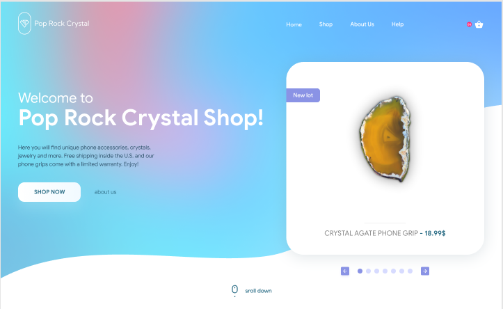

# Assignment

## NOTE
The website looks similar to the design at the width of 1440px.

## Additional Functionalities

1. Made the site fully responsive across devices.

2. Turned the navbar into a sidebar for mobile screens.

3. Added hover effects to the navbar items for a slick feel.

4. Gave the buttons in the intro section a hover effect to make them pop.

5. Added functionality to the left and right arrows in the intro section carousel.

6. Implemented a scroll animation for the "scroll down" button.

7. Added a hover effect on product cards in the "All Products" section.

8. Developed functionality for the "View All" button to reveal additional products.

9. Gave the "Buy Now" button in the Best Price section a neat hover effect.
